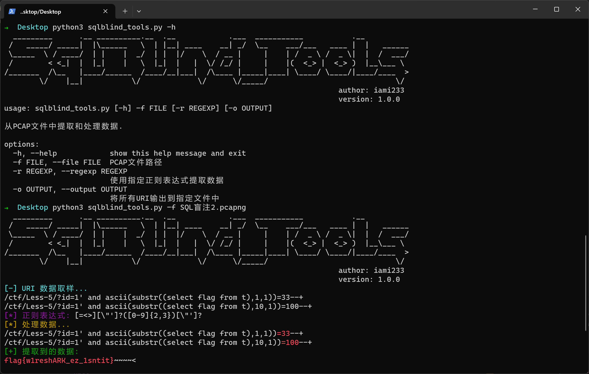

# SQLBlind_Tools

> SQLBlind_Tools，一款从PCAP文件中提取和处理数据的工具，用于快速完成SQL盲注流量分析题目

## 功能

```
optional arguments:
  -h, --help            show this help message and exit
  -f FILE, --file FILE  PCAP文件路径
  -r REGEXP, --regexp REGEXP 使用指定正则表达式提取数据
  -o OUTPUT, --output OUTPUT 将所有URI输出到指定文件中
```

## 快速开始

```bash
python3 sqlblind_tools.py -f demo/SQL盲注2.pcapng
```

